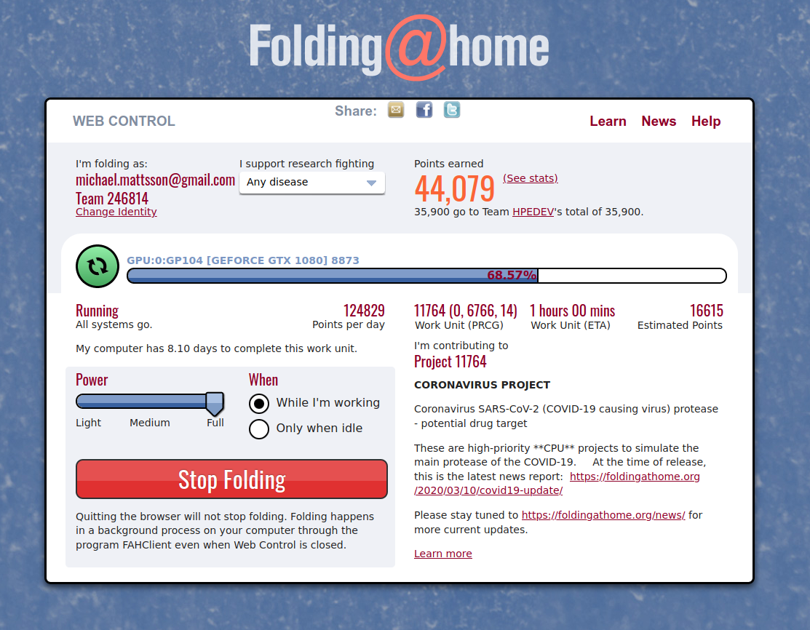

# Overview
These set of scripts and Ansible playbooks is supposed to be used on a desktop Ubuntu 18.04.4 LIVE booted x86 PC with unfettered access to the Internet. It turns the computer into a [Folding@Home](https://foldingathome.org/) (FAH) client that at this time of writing (3/21/20) has diverted its [entire distributed computing project](https://foldingathome.org/2020/03/15/coronavirus-what-were-doing-and-how-you-can-help-in-simple-terms/) to fight COVID-19.



# Before you begin
Running the FAH client on an idle computer means it consume idle CPU/GPU cycles to perform protein folding. This means that the computer will draw more power than usual. Make sure you have permission from whomever pays the bill to run the FAH client.

If the host is already installed with Ubuntu 18.04 and Docker there will most likely be a conflict unless you're using the official Docker, Inc repos, then you'll be fine. The installer does not resolve conflicting docker versions and you might end up with a broken system. If you're an advanced user you are better off following the instructions of the [upstream docker image](https://hub.docker.com/r/amalic/nvdocker-folding-home) being used in this project.

The intention of this project is to create a dedicated PC performing protein folding. If you want to use your day-to-day computer to donate CPU/GPU cycles to fight COVID-19, you're much better off simply installing the regular client from [the FAH website](https://foldingathome.org/start-folding/).

# Get started
This assumes the default mode by booting a PC from a USB stick. If you already have Ubuntu 18.04 installed or want to use your NVIDIA GPU, check the alternative install method.

- Download the Ubuntu [iso image](http://releases.ubuntu.com/18.04.4/ubuntu-18.04.4-desktop-amd64.iso) and make a bootable USB stick.
- When the node is booted, select your preferred language and then "Try Ubuntu". 
- On the Ubuntu desktop, right-click and select "Open Terminal" at the bottom of the popup menu.
- Optional: If you want you use a particular username or team, here are some variables to set:
  ```
  export FOLDER=MyUserName
  export TEAM=MyTeamNumber
  ```
  **Note:** Default values are Anonymous and no team.
- Type the following into the Terminal and hit enter to start the installer:
```
wget -q https://datamattsson.io/fah-bionic-bootstrap -O- | sudo -E bash
```
**Note:** If typing the above manually `-O-` is the letter O.
- When the installer finishes, the FAH client should be looking for work. Access the web UI on the computer by accessing [http://localhost:8080](http://localhost:8080)
- Thank you for donating your resources to fight COVID-19.

# Alternative install method
These procedures assumes you already have a Ubuntu 18.04 desktop running. If the PC has a NVIDIA GPU with the proper driver loaded, the FAH client will use the GPU instead of the CPU when looking for work.

- Install Ansible:
  ```
  apt-get install -y ansible
  ```
- Download and run the interactive installer:
  ```
  wget -q datamattsson.io/fah-bionic-installer -O /tmp/installer.yaml
  sudo ansible-playbook /tmp/installer.yaml
  ```
  **Note:** If typing the above manually `-O` is the letter O.
- When the installer finishes, the FAH client should be looking for work. Access the web UI on the computer by accessing [http://localhost:8080](http://localhost:8080)

# FAQ

#### How do I create a bootable USB stick?

There are multiple ways to do this. [Unetbootin](https://unetbootin.github.io/) (Windows, Linux, Mac), [balenaEtcher](https://www.balena.io/etcher/) (Mac) and [Rufus](https://rufus.ie) (Windows).

#### What is protein folding?

It's best described on [this Wikipedia page](https://en.wikipedia.org/wiki/Protein_folding).

#### My FAH client is not getting any work?

That means the FAH team is busy generating workloads for FAH clients. Be patient, your computer will soon be put to good use!

# Acknowledgements
This work was possible thanks to the [docker image](https://hub.docker.com/r/amalic/nvdocker-folding-home) built by [Alexander Malic](https://www.linkedin.com/in/alexandermalic).

# License
This work is [licensed](LICENSE).
